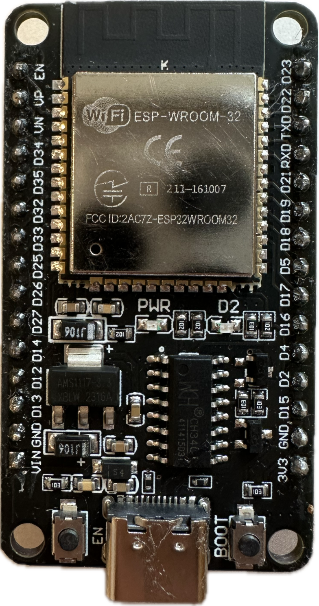
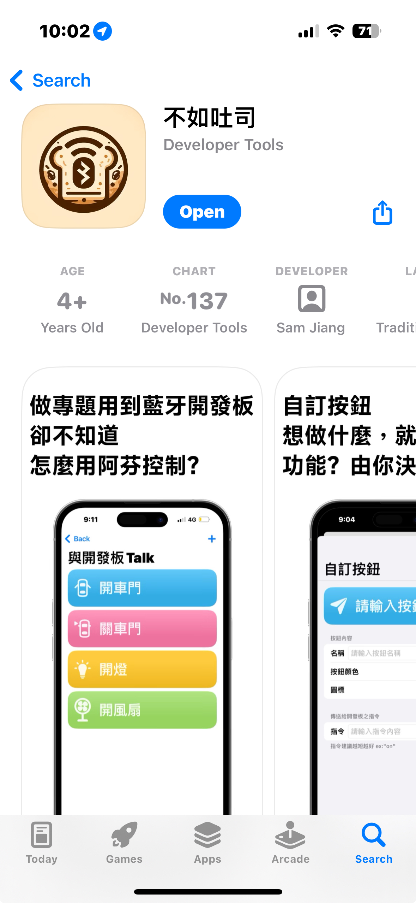
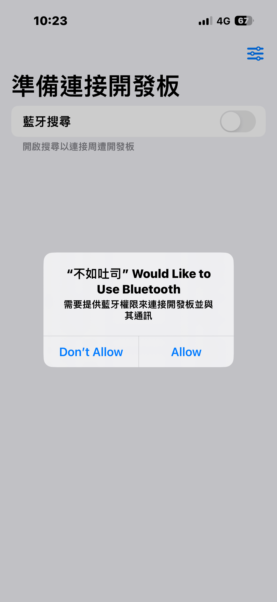
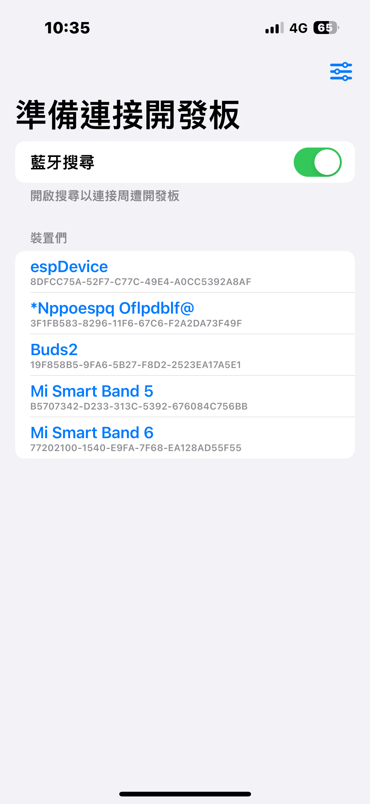
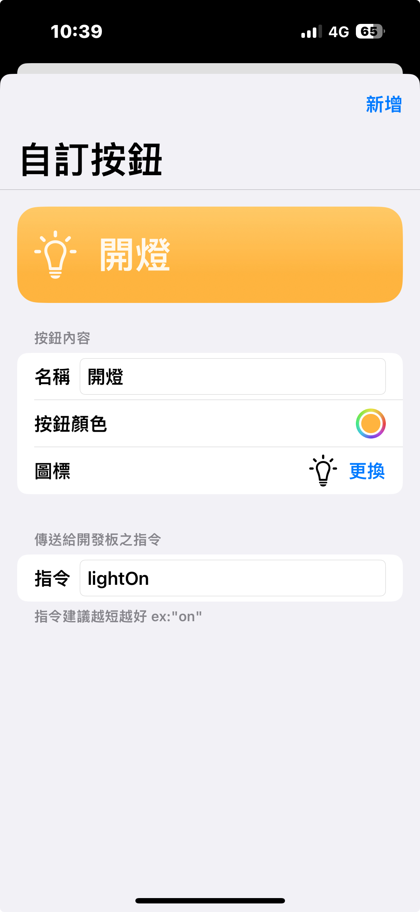
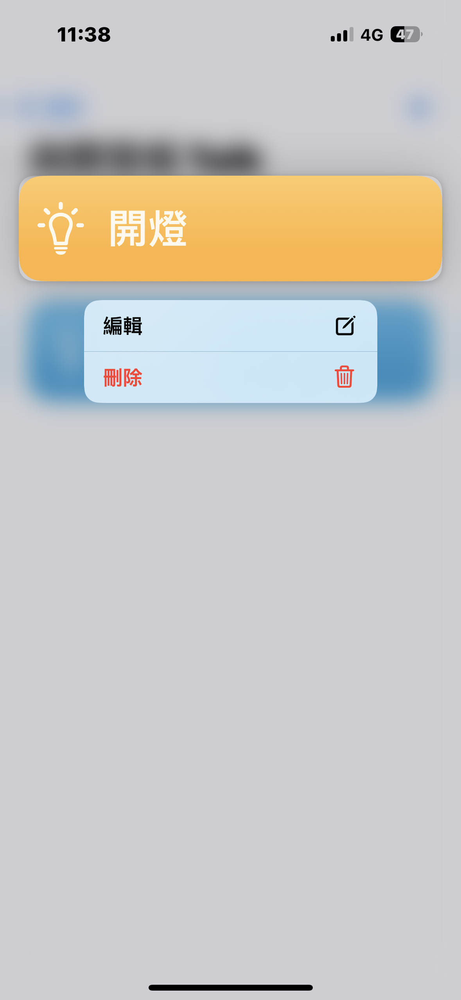

# 如何使用iOS設備控制藍牙開發板
本文章使用esp32作為範例

#### 以下所有測試皆使用ESP32 typeC版本進行驗證


## 方法
1. 將上方blueToastDemo資料夾下載並開啟(不熟悉GitHub操作的話可以至文章底部複製)
2. 到例如 https://www.uuidgenerator.net/  之類的UUID生成網站產生一份UUID，並將此行UUID替換掉
```c=14
#define myUuid "aaaaaaae-aaaa-aaaa-aaaa-aaaaaaaaaaaa"
```
3. 測試腳位為15，可自行更改
```c=12
#define testPin 15 // 測試腳位
```
4. 於Ios設備顯示之名稱，預設為"espDevice"，可自行更改
```c=54
BLEDevice::init("espDevice");
```
5. 撰寫自己所需功能程式，範例為開關燈範例程式，stringValue為藍牙接收到之指令(可在後續於App自定義)
```c=75
  // ----------------- ↓ 自定義功能區↓  -----------------
  // 以下為開燈範例，請自己撰寫所需功能
	if (stringValue == "lightOn") {
	  digitalWrite(testPin, 1);
    } else if (stringValue == "lightOff") {
	  digitalWrite(testPin, 0);
	}
  // ----------------- ↑ 自定義功能區↑  -----------------
```
6. 將程式燒入進開發板內
7. 至App Store下載 [不如吐司](https://apps.apple.com/tw/app/%E4%B8%8D%E5%A6%82%E5%90%90%E5%8F%B8/id6502551318)App

    

8. 授權藍牙權限

    

9. 如果順利的話應該開啟後就會找到你取的裝置名稱

    

10. 連接裝置後可以點擊右上角加號新增自訂按鈕，編輯頁面最下方輸入指令區為設定藍牙傳送之字串，按下按鈕後即發送此串字串，而同時開發板程式中的stringValue變數會變為接收到之字串。

    圖標庫是使用蘋果系統內建的[SF Symbols](https://developer.apple.com/sf-symbols/)所以搜尋時需使用英文名稱搜尋，此圖標庫有5000多個圖標，若找不到理想icon時可以多換關鍵字搜尋，例如燈相關可以搜尋"light"之類的單字。

    

11. 想要刪除或編輯按鈕的話長按按鈕即可叫出選單選擇

    

## 常見問題

**Q:** Arduino IDE板子選單中沒有看到任何一個ESP32板子

**A:** 可以參考[此篇教學](https://www.nmking.io/index.php/2022/09/13/112/#htoc-esp321)進行設定

---

**Q:**  程式沒有報錯但沒有辦法燒入進去

**A:** 先確認板子型號是否正確，正確的話可以嘗試在Arduino IDE上方選單 編輯>>上傳速率(Upload Speed) 改為115200嘗試看看，大概率都是上傳速率的問題，而本文章使用的ESP32是選用"ESP32 Dev Module"進行燒入

---

**Q:** 不如吐司有Bug或是想要增加什麼功能該怎麼辦？

**A:** 可以上[xamjiang.com/contact](https://xamjiang.com/contact)聯絡開發者，或是透過GitHub issues都可以，開發者人好的程度滿分五顆心他大概有六顆心，所以都很歡迎提出指教😚

---

**Q:** 其他玄學問題

**A:** 放置[乖乖](https://www.kuai.com.tw/home.jsp?lang=tw)於開發板旁即可(Maybe)

## 完整範例程式
```c
#include <BLEDevice.h>
#include <BLEServer.h>
#include <BLEUtils.h>
#include <BLE2902.h>

BLEServer *pServer = NULL;
BLECharacteristic * pTxCharacteristic;
String stringValue = "";
bool deviceConnected = false;
bool oldDeviceConnected = false;
uint8_t value[2];
#define testPin 15 // 測試腳位
// ↓ 請至 https://www.uuidgenerator.net/ 自行產生一組 UUID
#define myUuid "aaaaaaae-aaaa-aaaa-aaaa-aaaaaaaaaaaa"
// 	↑請將上方字串更換為自己的 UUID
#define service_uuid myUuid
#define rx_uuid myUuid
#define tx_uuid myUuid

class MyServerCallbacks: public BLEServerCallbacks{
  void onConnect(BLEServer* pServer){
    deviceConnected = true;
  };
  void onDisconnect(BLEServer* pServer){
    deviceConnected = false;
    }
};
String values(uint8_t value) {
  char hex[2];
  sprintf(hex, "%02X", value);
  return hex;
};

class MyCallbacks: public BLECharacteristicCallbacks {
  void onWrite(BLECharacteristic *pCharacteristic) {
    std::string rxValue = pCharacteristic->getValue();
    if (rxValue.length() >0) {
      String allValues = "";
      String stringValues = "";
      for(int i=0; i<rxValue.length(); i++) allValues += values(rxValue[i]);
      for(int i=0; i<rxValue.length(); i++) stringValues += rxValue[i];
      Serial.println(allValues);
      Serial.println(stringValues);
      value[0] = rxValue[0];
      value[1] = rxValue[1];
    }
  }
};


void setup() {
  pinMode(testPin, OUTPUT);
  Serial.begin(115200);
  // 裝置名稱↓ 
  BLEDevice::init("espDevice");
  // 裝置名稱↑
  pServer = BLEDevice::createServer();
  pServer->setCallbacks(new MyServerCallbacks());
  BLEService *pService = pServer->createService(service_uuid);
  pTxCharacteristic = pService->createCharacteristic(tx_uuid, BLECharacteristic::PROPERTY_NOTIFY);
  pTxCharacteristic->addDescriptor(new BLE2902());
  BLECharacteristic * pRxCharacteristic = pService->createCharacteristic(rx_uuid, BLECharacteristic::PROPERTY_WRITE);
  pRxCharacteristic->setCallbacks(new MyCallbacks());
  pService->start();
  pServer->getAdvertising()->start();
  Serial.println("waiting a client connection to notify...");
}

void loop(){
  if(deviceConnected) {
    pTxCharacteristic->setValue((uint8_t*)&value, sizeof(value));
    pTxCharacteristic->notify();
		delay(10);
	}
  // ----------------- ↓ 自定義功能區↓  -----------------
  // 以下為開燈範例，請自己撰寫所需功能
	if (stringValue == "lightOn") {
	  digitalWrite(testPin, 1);
  } else if (stringValue == "lightOff") {
	  digitalWrite(testPin, 0);
	}
  // ----------------- ↑ 自定義功能區↑  -----------------
 
	if (!deviceConnected && oldDeviceConnected) {
	  delay(500);
	  pServer->startAdvertising();
	  Serial.println("start advertising");
	  oldDeviceConnected = deviceConnected;
	}
	if (deviceConnected && !oldDeviceConnected) {
	  oldDeviceConnected = deviceConnected;
	}
}

```